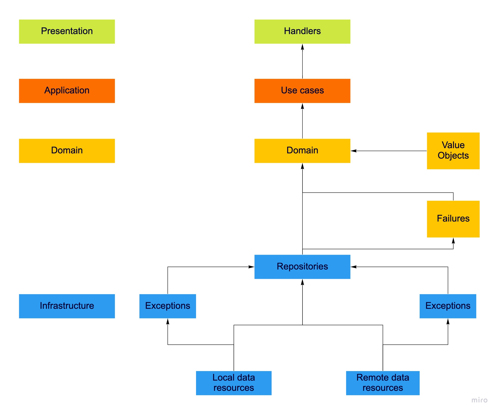

# Template Serverless + Localstack
## Project Architecture

This project implements a simplify mode of [**Clean Architecture**](https://blog.cleancoder.com/uncle-bob/2012/08/13/the-clean-architecture.html)



### Project structure

The project code base is mainly located within the `src` folder. This folder is divided in:

- `bounded-context` - containing code base and configuration for your lambda functions
- `shared` - containing shared code base between your lambdas

```
.
├── tests				         # Unit tests
├── src
│   ├── bounded-context          # Lambda configuration and source code folder
│   │   ├── presentation
│   │   │   ├── handler.ts
│   │   │   ├── index.ts
│   │   │   └── schema.ts
│   │   ├── application         # Application business logic (Use cases).      
│   │   │   └── UseCase.ts
│   │   ├── domain              # Enterprise business logic.
│   │   │   ├── Entity
│   │   │   ├── Failures
│   │   │   └── ValueObjects
│   │   └── infrastructure      # Interface to communicate with other contexts. (Local and remote resources), repositories.
│   │
│   └── shared                  # Lambda shared code
│       └── apiGateway.ts       # API Gateway specific helpers
│       └── handlerResolver.ts  # Sharable library for resolving lambda handlers
│       └── lambda.ts           # Lambda middleware
│
├── package.json
├── serverless.ts               # Serverless service file
├── tsconfig.json               # Typescript compiler configuration
├── tsconfig.paths.json         # Typescript paths
└── webpack.config.js           # Webpack configuration
```

## Prerequisite Software

Before you can work with this project, you must install and configure the following products on your development machine:

- [AWS CLI](https://docs.aws.amazon.com/cli/latest/userguide/install-cliv2.html) on Mac computers, it's easier to install it using Homebrew: `brew install awscli`
- [Git](http://git-scm.com) and/or the **GitHub app** (for [Mac](http://mac.github.com) or [Windows](http://windows.github.com))
- [Node.js](http://nodejs.org) - **Current version** _v14_
- [Serverless](https://www.serverless.com/framework/docs/getting-started/)
- [Docker](https://docs.docker.com/engine/install/)
- [Yarn](https://yarnpkg.com/getting-started/install)

It is recommendable to install node via [NVM](https://github.com/nvm-sh/nvm)

## Set up your AWS Credentials

1. Log in into Aws Console
2. Expand **Aws Account** --> _Command line or programmatic access_
3. Find and copy **AWS Access Key ID** and **AWS Secret Access Key**

Now you have the information required to create a credential file:

```shell
# Run
> aws configure

# Required Data
> AWS Access Key ID [None]: XXXXXXXXXXXXXXXXXXXXX
> AWS Secret Access Key [None]: XXXXXXXXXXXXXXXXXXXXX
> Default region name [None]: us-east-1
> Default output format [None]: json
```

Now validate that changes have been saved

```shell
cat ~/.aws/credentials
```

## Configure AWS Locally

```shell
> export AWS_PROFILE=indigo-dev
```
## Getting the Sources

Clone this repository:

1. Log in to your GitHub account [Indigo GitHub](https://github.com/Indigo-io) and follow the instruction below:

```shell
# Clone
> git clone git@github.com:Indigo-io/indigo-template-serverless-localstack.git


# Go to the sources directory:
> cd template-serverless-localstack

```

## Installing NPM Modules

Next, install the JavaScript modules needed to build and test the app:

```shell
# Install project dependencies (package.json)
> yarn install
```

## Quick Start

How to run your local environment.

```
yarn aws-sso-login
yarn sso-login
```

To test it, issue the following command

```
yarn invoke:world 
```
